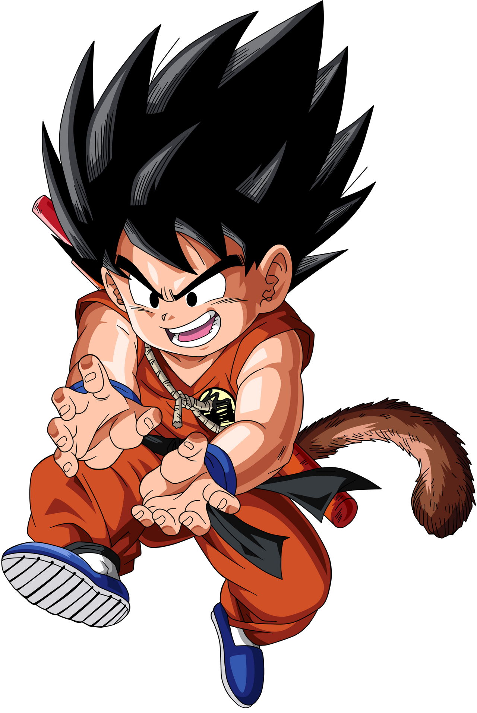

# Objeto Pelota

Este directorio contiene la implementación del objeto **Pelota**, dividido en módulos según su funcionalidad.

## Descripción

El objeto Pelota gestiona aspectos relacionados con:
- **Deporte:** Información y funcionalidades relacionadas con el deporte.
- **Peso:** Gestión del peso y balance de la pelota.
- **Uso:** Funcionalidades operativas de la pelota.
s
## Diagrama de la Estructura

A continuación, se muestra un diagrama ilustrativo de la estructura del objeto, utilizando una imagen alojada en internet:



## Módulos

- **deporte.py:** Lógica relacionada con el deporte.
- **peso.py:** Cálculos y gestión del peso.
- **uso.py:** Funciones relacionadas con el uso de la pelota.

## Instrucciones de Uso

Para utilizar esta implementación, importa el módulo principal y accede a las funcionalidades específicas:

```python
from pelota import Pelota

mi_pelota = Pelota()
mi_pelota.mostrar_info()
